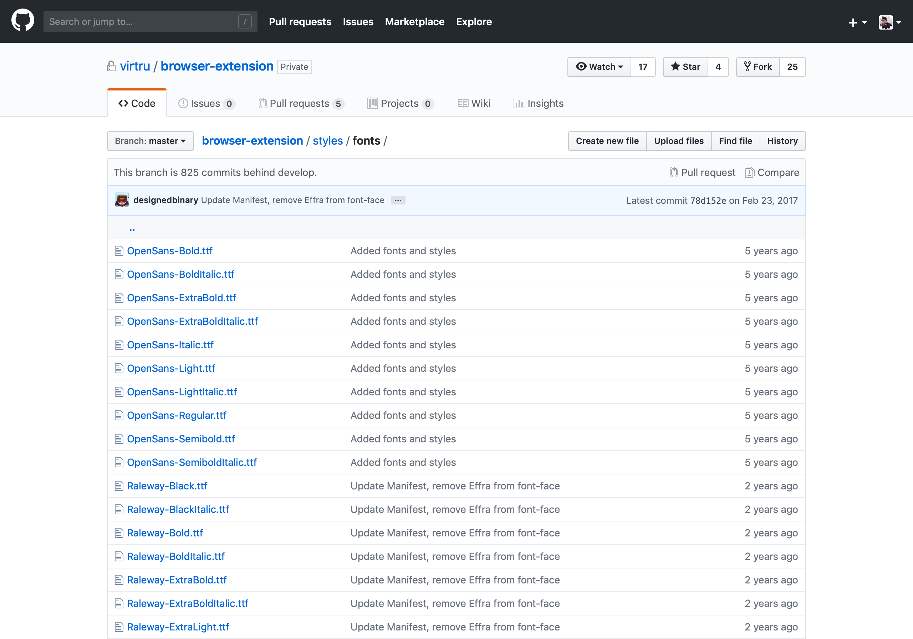
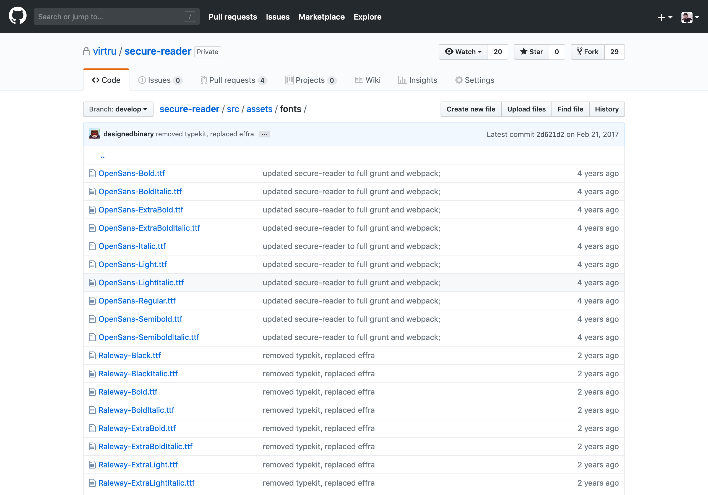
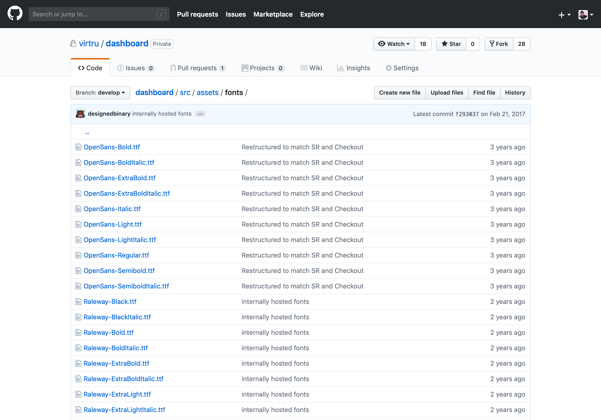
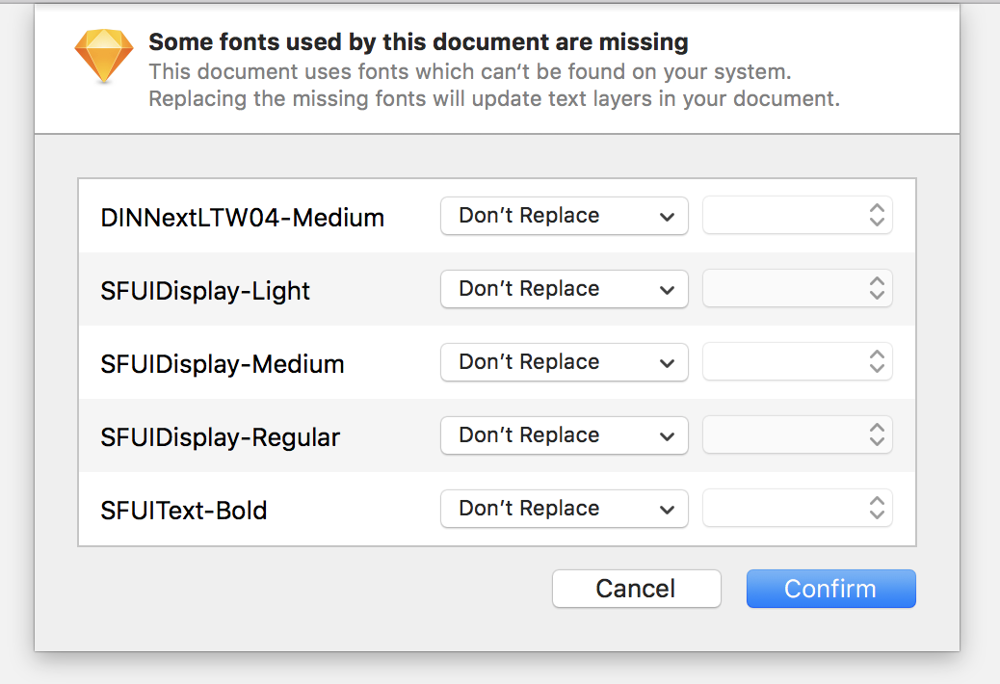

# Virtru Typography

One, consistent set of fonts for the Virtru brand to be used by designers and engineers across our products.

## What problems does this solve?

### 1. DRY—duplication of font assets

These are the same fonts repeated again and again:

A. A Browser Plugin


B. Secure Reader


C. Dashboard



### 2. The same fonts coming from different sources

Where is this coming from? Which is canonical?


### 3. Design programs treating the same fonts as different fonts, locally




### 4. New designer onboarding—how do I get fonts locally?

As of 2018, undocumented and thus, inconsistent.

# Intro for Designers 

## Install on macOS

1. Download the [latest release](https://github.com/virtru/virtru-typography/releases) of this repo: **Assets > Source code** (zip)
1. Open Font Book.
1. In the **User** section, remove any font families that appear in this repo.
1. Install the downloaded fonts by opening them in Font Book. There should be no validation or duplicate font warnings.
1. Deactivate any fonts in this repo above in [Adobe Fonts](https://fonts.adobe.com/my_fonts).

# Intro for Engineers
## Installation
This repo is ready for installation as npm package:
```
npm install --save git+ssh://git@github.com/virtru/virtru-typography.git
```

Once it's installed, add this to your application: 
```js
require('virtru-typography');
```  

This assumes that you're using webpack with relevant loaders for css and font files.
Feel free to use dashboard and dashboard-v2 commits as a reference for adding `virtru-typography` to the existing projects:
https://github.com/virtru/dashboard/pull/649/files 
https://github.com/virtru/dashboard-v2/pull/542/files

### Usage
This repo ships css files with `@font-face` directives as well as `woff`, `woff2`, `ttf` fonts right into your project.
To use fonts in your app you just need to specify relevant font in your css:
```css
.text {
  font: 300 16px 'Open Sans', Helvetica, Arial, sans-serif;
}
``` 

```css
.text {
  font-style: italic; 
  font-family: 'Raleway', Helvetica, Arial, sans-serif;
}
``` 

### Possible problems
- If your fonts don't load from CDN, check out this dashboard fix: https://github.com/virtru/dashboard/pull/665 


# Governance

## Adding fonts

TBD

## Removing fonts

TBD

## Generating new font files (for localization, performance, etc.)

[How to Generate WOFF & WOFF2 fonts](https://github.com/virtru/virtru-typography/wiki/Generating-WOFF-&-WOFF2-fonts)
